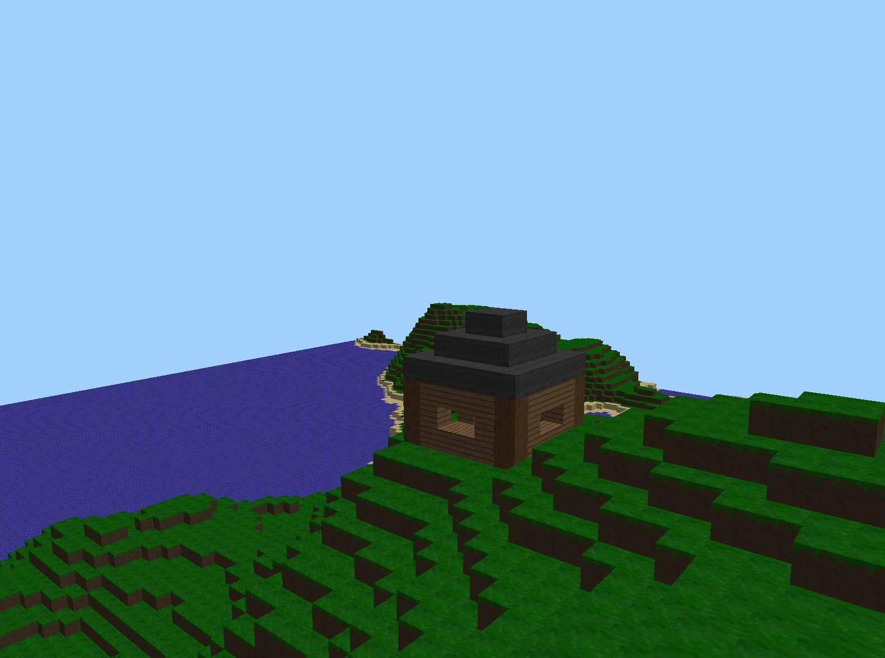
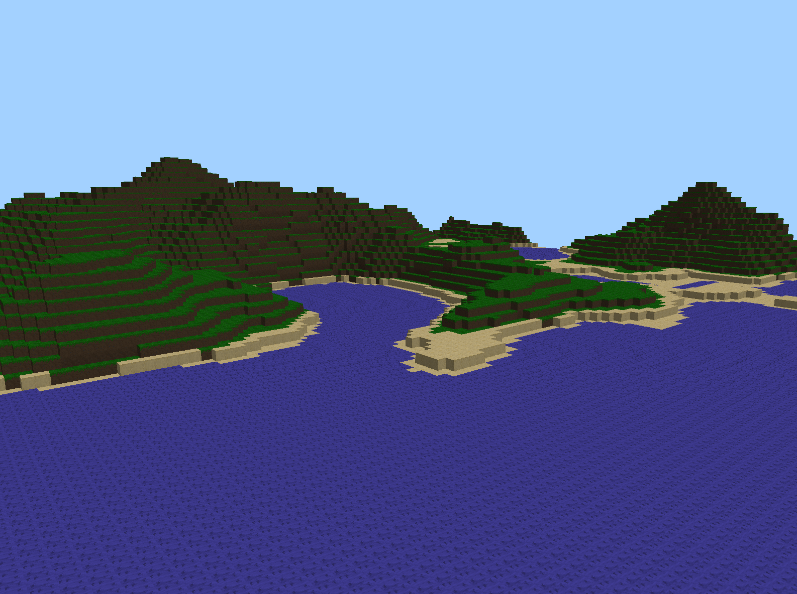
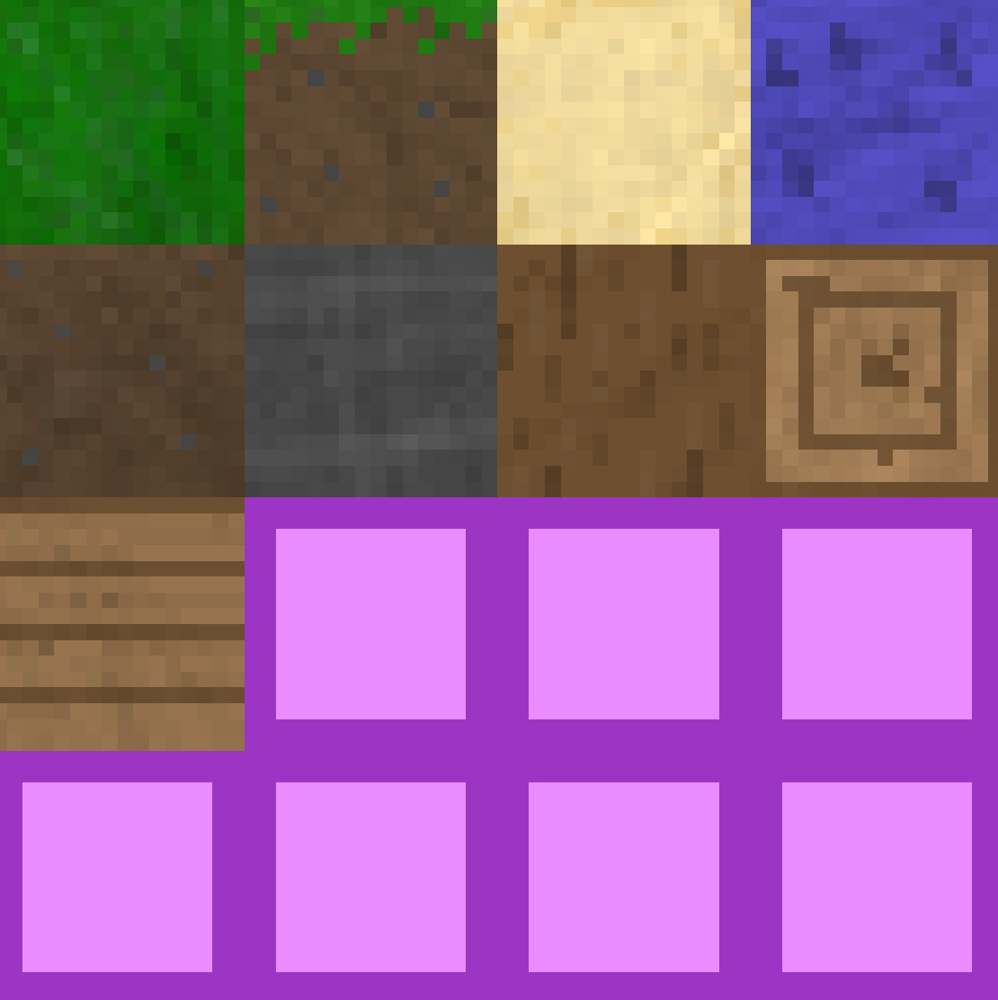
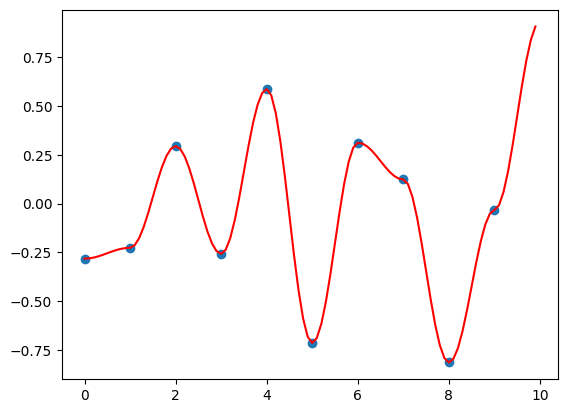
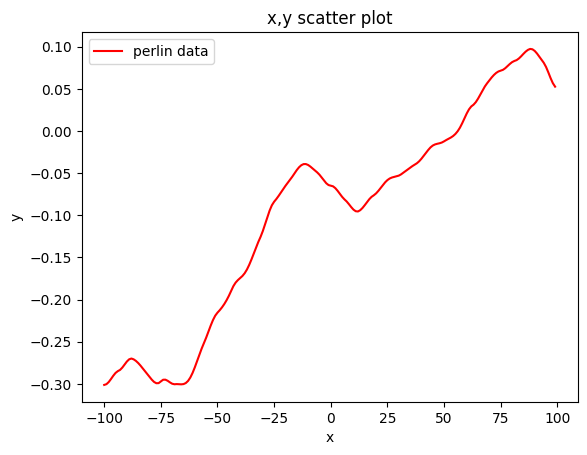
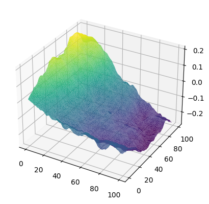

# **Minecraft-like OpenGL Game Engine**  
---

## **Overview**  
This is a C++ game engine using OpenGL to render a block-based world. It features dynamic mesh generation, real-time rendering with shaders, player movement with collision detection, and efficient chunk-based world management.  

## **Features**  
- **OpenGL Rendering**: Uses shaders, VAO/VBO, and textures for efficient 3D graphics.  
- **Dynamic Mesh Generation**: Only visible faces of blocks are rendered to optimize performance.  
- **Chunk-based World System**: The world is divided into chunks that load and unload dynamically.  
- **Player Movement & Collision Detection**: Supports movement with gravity, jumping, and collision checks against blocks.  
- **Custom Shader Management**: Handles vertex and fragment shaders for lighting and texturing.  

## **Code Structure**  
### **Core Components**  
- `game.cpp`: Main game loop, handling updates and rendering.  
- `window.cpp`: Initializes GLFW, processes input, and manages OpenGL context.  
- `renderer.cpp`: Handles rendering, shader usage, and texture binding.  
- `shader.h`: Loads and compiles shaders.  
- `player.cpp`: Implements movement, camera controls, and collision detection.  
- `world.cpp`: Manages the world’s chunks and block storage.  
- `chunk.cpp`: Generates and stores block data, optimizes mesh creation.  
- `terrainGeneration.cpp`: Implements Perlin Noise.

## **Key Concepts**  
### **OpenGL Rendering**  
- Uses shaders (`blockVertexShader.glsl`, `blockFragShader.glsl`) to handle lighting and textures.  
- Uses VAOs and VBOs for efficient rendering of block meshes.  
- Applies transformation matrices (`model`, `view`, `projection`) for 3D rendering.  

### **Block & World System**  
- The world consists of **chunks**, each storing blocks in a 3D array.  
- Only **visible** block faces are rendered to improve performance.  
- Uses **Perlin noise** for terrain generation.  

- Textures are loaded from a texture offsets and applied to blocks with TexCoord offsets

### **Player Movement & Collisions**  
- Movement controlled via keyboard (`WASD` for movement, `SPACE` for jumping).  
- Uses **AABB collision detection** to prevent the player from passing through blocks.  
- Implements **gravity** and jumping mechanics.  

## **Controls**  
- `WASD` - Move forward, backward, left, right  
- `SPACE` - Jump  
- `CTRL` - Sprint
- `ESC` - Quit the game  
- `F` - Fly mode (no gravity)
- `SHIFT` - Fly down
- `LEFT MOUSE BUTTON` - Place block
- `RIGHT MOUSE BUTTON` - Remove block
- `MIDDLE MOUSE BUTTON` - Pick block type

## **Perlin Noise**
The perlin Noise function generates smooth random values with high and low frequencies. It is used to generate terrain with varying heights and slopes.  

It works by generating random points and interpolating between them with a cosine interpolation function. The result is a smooth gradient that can be used for terrain generation, clouds, and other natural phenomena.

Multiple octaves (noise with higher frequncy but lower amplitude) of perlin noise can be combined to create more complex patterns. The noise function can be scaled and offset to create different effects.

This can be expanded to 2D to generate smooth terrain with varying heights and slopes.

## **Future Improvements**  
- Add lighting and shadows. 
- Make water transparent and reflective. 
- Optimize rendering using instancing or greedy meshing.  
- Improve physics with smoother movement and collision handling. 
- Add more block types and textures. 

